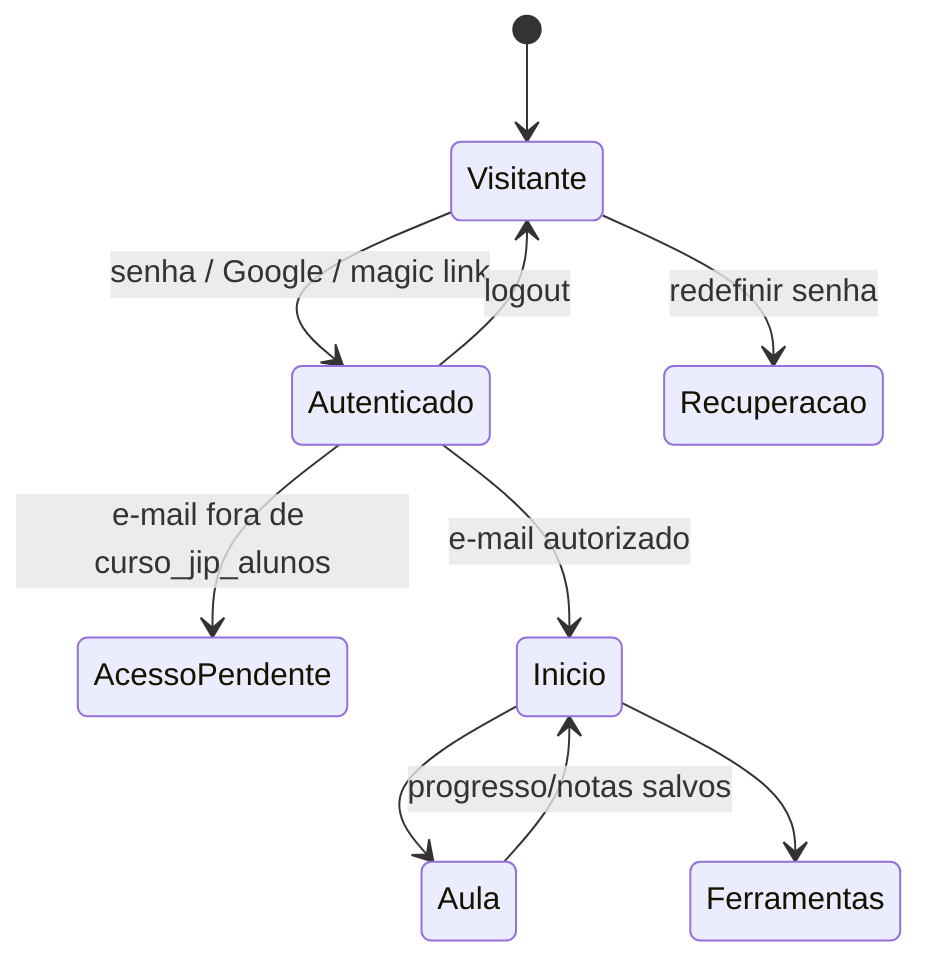

# Curso JIP — área do aluno

## Arquitetura

O frontend é uma SPA estática servida pelo Netlify. Autenticação, autorização e
estado privado ficam no Supabase.



Não há triagem OpSec, quiz de segurança nem “credencial” antes do conteúdo. No
primeiro acesso pago, `onboarding_completed` é marcado automaticamente (ou o
gate é ignorado se a gravação falhar).

### Limites de confiança

- A chave `anon` do Supabase é pública por definição. A segurança depende de RLS.
- `curso_jip_alunos` decide quem comprou/foi autorizado.
- A Edge Function `curso-catalog` valida o JWT e chama
  `curso_jip_pode_ler_catalogo()` antes de entregar as 31 aulas.
- `jornalismo/content/aberto.json` contém somente as aulas públicas 3.2 e 3.3.
- Não há fallback para `aulas.json` público.
- Notas são privadas por RLS, mas **não** são descritas como criptografia ponta a
  ponta. O aluno é orientado a não armazenar identificadores de fontes.
- HTML de roteiro recebido pelo catálogo passa por uma allowlist no cliente.

## Instalação no Supabase

No SQL Editor, nesta ordem:

1. `jornalismo/supabase/curso-jip.sql`
2. `jornalismo/supabase/curso-jip-alunos.sql`
3. `jornalismo/supabase/curso-jip-operacoes.sql`

Depois publique a função:

```bash
npx supabase login
npx supabase link --project-ref fveslvzjjixzpwiqcydz
npx supabase functions deploy curso-catalog
```

O Supabase injeta `SUPABASE_URL` e `SUPABASE_ANON_KEY` automaticamente na
função. O catálogo pago está em
`supabase/functions/curso-catalog/aulas.json`. Os binários usam `static_files`;
mantenha o Docker em execução durante o deploy para que o CLI os empacote.

> Enquanto a migração e a Edge Function não forem publicadas, a interface mostra
> um bloqueio honesto de configuração. Ela não volta a buscar o catálogo pago no
> CDN público.

## Autenticação

Ative Email/Senha e Google em Authentication → Providers. URLs autorizadas:

- `https://iuripiragibe.net/jornalismo/app.html`
- `http://127.0.0.1:4173/jornalismo/app.html` para desenvolvimento

O cadastro exige senha de 12 caracteres com maiúscula, minúscula, número e
símbolo. Cadastro e compra são estados separados: criar conta não concede acesso.
Mensagens de login/recuperação evitam enumerar usuários.

## Persistência

- Perfil (`onboarding_completed` automático): `curso_jip_perfis`
- Pauta (opcional, em Minha conta): `curso_jip_pautas`
- Notas/exercícios: `curso_jip_exercicios`
- Progresso: `curso_jip_progresso`
- Registros opcionais: `curso_jip_evidencias`

Não existe fallback para `localStorage`; uma falha de gravação é exibida e não é
rotulada como sincronizada.

## Recursos entregues

Os três arquivos ficam no bundle privado da Edge Function e são baixados pela
interface com o JWT do aluno:

- `planilha-de-cruzamento.xlsx`
- `materiais-bonus.pdf`
- `documento-completo-curso.md`

Não existem cópias públicas em `/jornalismo/downloads/`.

O vídeo não é simulado. Sem URL real, a aula mostra “Vídeo ainda não publicado”
e oferece o roteiro, ferramentas da aula e notas privadas.

## Verificação

```bash
npm test -- tests/jornalismo-curso.spec.ts
```

Os testes cobrem rotas públicas, guarda de autenticação, autorização, início
sem OpSec, estado salvo e ausência do catálogo pago no diretório público.
