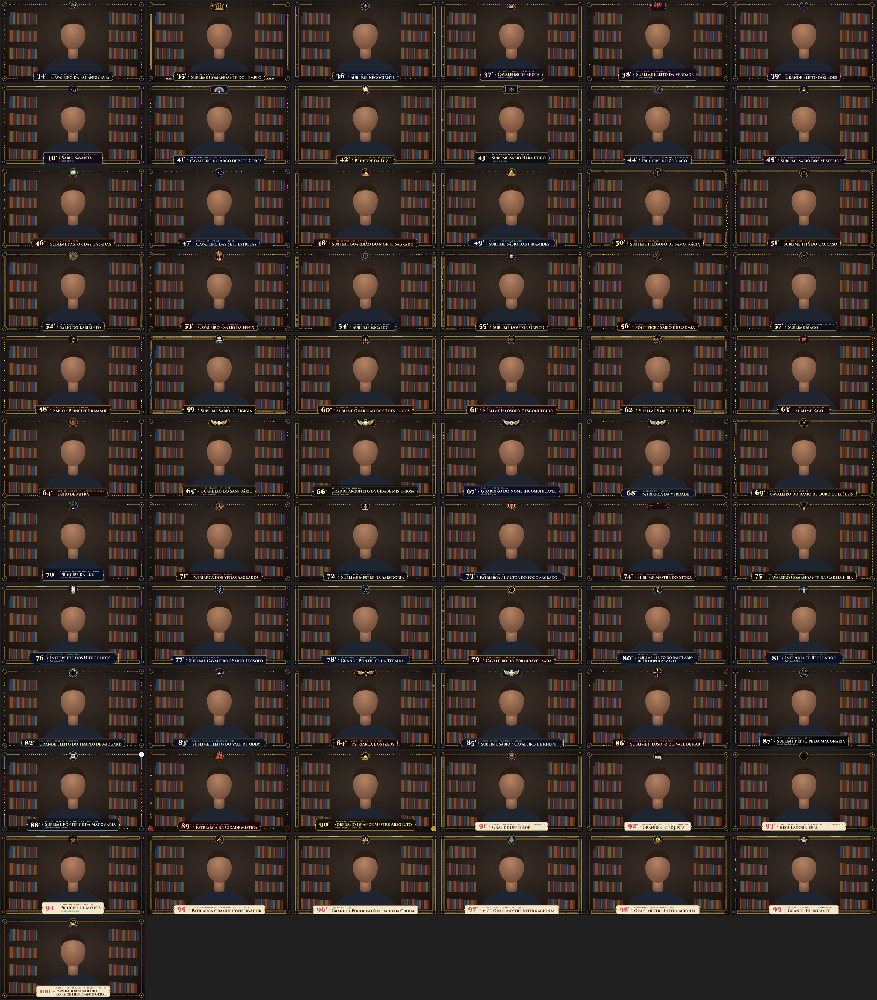
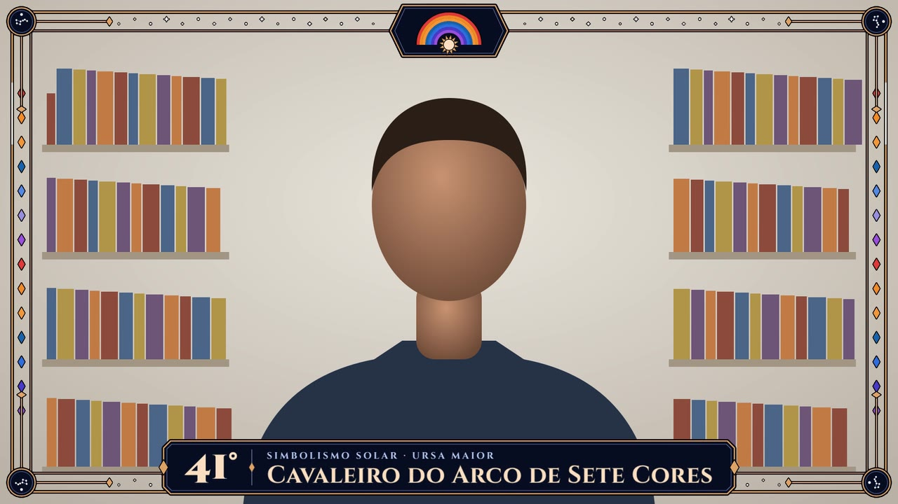

# Overlays — Maçonaria Egípcia (graus 34° a 99°)

Overlays animados para o vídeo "A maçonaria mais misteriosa não tem 33 graus. Tem 99." — um por grau,
com o **número e o nome do grau** numa placa na base e uma **moldura temática** que faz referência ao
conteúdo do grau (runas no 34°, colunas Boaz e Jachin no 35°, labirinto no 52°, corrente de ouro no 75°,
a Árvore da Vida no 77°, a serpente de fogo subindo pelas laterais no 88°…).



## O que tem aqui

| Pasta | Conteúdo |
|---|---|
| `mp4/` | **Os vídeos para editar.** 1920×1080, 30 fps, H.264, fundo verde `#00FF00` para chroma key. |
| `svg/` | Os mesmos overlays em SVG animado (fundo transparente). Abra no navegador para ver a animação. |
| `preview/` | Prancha com todos os graus e uma prévia de como fica sobre um talking head. |
| `index.html` | Galeria local: abre todos os SVG animados de uma vez, com link para cada MP4. |
| `gerador/` | O código que gera tudo (para mudar textos, cores ou duração). |

São **67 overlays**: do 34° ao 99°, mais o **89°** (o roteiro só o cita como "Rubedo"; o nome
*Patriarca da Cidade Mística* vem da escala de Misraïm) e o **100°** de bônus (Palermo), já que o roteiro menciona.

## Como cada vídeo funciona

- **0 s → ~2,5 s:** entrada animada (a moldura se desenha, a placa abre, as letras sobem, o brasão aparece).
- **Depois de 3 s:** animação ambiente discreta (brilho correndo pela moldura, glifos acendendo, chamas, estrelas)
  em um ciclo de 8 s que **emenda perfeitamente** — dá para cortar em qualquer ponto.
- **Duração:** calculada pelo texto do roteiro de cada grau (≈2,4 palavras/s + 4 s de folga, mínimo 10 s).
  O 88°, que é o mais longo, tem 75 s. Se sobrar, é só cortar o final; se faltar, duplique o clipe a partir de 0:03
  (ou mude a duração e renderize de novo — veja abaixo).

## Como usar no editor (chroma key)

Coloque o MP4 numa faixa **acima** do talking head e remova o verde:

- **CapCut:** adicione o MP4 como sobreposição, selecione o clipe e abra a opção de **Chroma key**
  (fica em *Remover fundo* ou *Recortar*, conforme a versão) → conta-gotas no verde → suba a intensidade até o
  verde sumir (~10–20).
- **Premiere Pro:** efeito *Ultra Key* → conta-gotas no verde (o padrão já funciona).
- **DaVinci Resolve:** *Effects* → *3D Keyer* (ou a aba *Qualifier* no Color) → selecione o verde.
- **Final Cut Pro:** efeito *Keyer* (detecta o verde sozinho).



Dica: as cores do design evitam verde de propósito (inclusive a faixa "verde" do arco-íris do 41° e o Leão Verde
do 46°, que usam um verde-azulado/verdigris), para nada sumir junto com o fundo.

## Lista de graus

**Grande Consistório**

| Grau | Nome | Tema na moldura | Duração | Arquivo |
|---|---|---|---|---|
| 34° | Cavaleiro da Escandinávia | Mitologia nórdica · Odin · Runas | 19 s | [mp4](mp4/34-cavaleiro-da-escandinavia.mp4) · [svg](svg/34-cavaleiro-da-escandinavia.svg) |
| 35° | Sublime Comandante do Templo | O Templo como imagem do Universo | 10 s | [mp4](mp4/35-sublime-comandante-do-templo.mp4) · [svg](svg/35-sublime-comandante-do-templo.svg) |
| 36° | Sublime Negociante | Geometria · Astronomia caldaica | 15 s | [mp4](mp4/36-sublime-negociante.mp4) · [svg](svg/36-sublime-negociante.svg) |
| 37° | Cavaleiro de Shota — Sábio da Verdade | Tradições iniciáticas antigas | 16 s | [mp4](mp4/37-cavaleiro-de-shota.mp4) · [svg](svg/37-cavaleiro-de-shota.svg) |
| 38° | Sublime Eleito da Verdade — A Águia Vermelha | Luz × Trevas · Dualismo cósmico | 12 s | [mp4](mp4/38-sublime-eleito-da-verdade.mp4) · [svg](svg/38-sublime-eleito-da-verdade.svg) |
| 39° | Grande Eleito dos Eões | Gnosticismo valentiniano · Éons | 11 s | [mp4](mp4/39-grande-eleito-dos-eoes.mp4) · [svg](svg/39-grande-eleito-dos-eoes.svg) |
| 40° | Sábio Savaísta — Sábio Perfeito | Leis da natureza · Alfa e Ômega | 10 s | [mp4](mp4/40-sabio-savaista.mp4) · [svg](svg/40-sabio-savaista.svg) |
| 41° | Cavaleiro do Arco de Sete Cores | Simbolismo solar · Ursa Maior | 25 s | [mp4](mp4/41-cavaleiro-do-arco-de-sete-cores.mp4) · [svg](svg/41-cavaleiro-do-arco-de-sete-cores.svg) |
| 42° | Príncipe da Luz | Pureza · Desinteresse · Justiça | 10 s | [mp4](mp4/42-principe-da-luz.mp4) · [svg](svg/42-principe-da-luz.svg) |
| 43° | Sublime Sábio Hermético — Filósofo Hermético | Hermetismo · As 12 casas do Sol | 16 s | [mp4](mp4/43-sublime-sabio-hermetico.mp4) · [svg](svg/43-sublime-sabio-hermetico.svg) |
| 44° | Príncipe do Zodíaco | Zodíaco · Os 12 trabalhos de Hércules | 15 s | [mp4](mp4/44-principe-do-zodiaco.mp4) · [svg](svg/44-principe-do-zodiaco.svg) |
| 45° | Sublime Sábio dos Mistérios | Da escuridão à luz · O número três | 10 s | [mp4](mp4/45-sublime-sabio-dos-misterios.mp4) · [svg](svg/45-sublime-sabio-dos-misterios.svg) |
| 46° | Sublime Pastor das Cabanas | Alquimia · O Leão Verde | 23 s | [mp4](mp4/46-sublime-pastor-das-cabanas.mp4) · [svg](svg/46-sublime-pastor-das-cabanas.svg) |
| 47° | Cavaleiro das Sete Estrelas | Ursa Maior · Saptarshi · Plêiades | 11 s | [mp4](mp4/47-cavaleiro-das-sete-estrelas.mp4) · [svg](svg/47-cavaleiro-das-sete-estrelas.svg) |
| 48° | Sublime Guardião do Monte Sagrado | Mistérios supremos · O altar | 10 s | [mp4](mp4/48-sublime-guardiao-do-monte-sagrado.mp4) · [svg](svg/48-sublime-guardiao-do-monte-sagrado.svg) |
| 49° | Sublime Sábio das Pirâmides | Egito · 21 degraus vermelhos | 15 s | [mp4](mp4/49-sublime-sabio-das-piramides.mp4) · [svg](svg/49-sublime-sabio-das-piramides.svg) |
| 50° | Sublime Filósofo de Samotrácia | Mistérios de Samotrácia · Cabiros | 19 s | [mp4](mp4/50-sublime-filosofo-de-samotracia.mp4) · [svg](svg/50-sublime-filosofo-de-samotracia.svg) |
| 51° | Sublime Titã do Cáucaso | Prometeu · O dom do fogo | 10 s | [mp4](mp4/51-sublime-tita-do-caucaso.mp4) · [svg](svg/51-sublime-tita-do-caucaso.svg) |
| 52° | Sábio do Labirinto | Hermetismo · Hermes Trismegisto | 12 s | [mp4](mp4/52-sabio-do-labirinto.mp4) · [svg](svg/52-sabio-do-labirinto.svg) |
| 53° | Cavaleiro / Sábio da Fênix | Rosacruz · Morte e ressurreição | 12 s | [mp4](mp4/53-cavaleiro-sabio-da-fenix.mp4) · [svg](svg/53-cavaleiro-sabio-da-fenix.svg) |
| 54° | Sublime Escaldo | Poesia escandinava · Os escaldos | 13 s | [mp4](mp4/54-sublime-escaldo.mp4) · [svg](svg/54-sublime-escaldo.svg) |
| 55° | Sublime Doutor Órfico | Mistérios órficos · Dioniso Zagreu | 14 s | [mp4](mp4/55-sublime-doutor-orfico.mp4) · [svg](svg/55-sublime-doutor-orfico.svg) |
| 56° | Pontífice / Sábio de Cádmia | Alquimia · 7 tons, 7 cores, 7 vogais | 24 s | [mp4](mp4/56-pontifice-sabio-de-cadmia.mp4) · [svg](svg/56-pontifice-sabio-de-cadmia.svg) |
| 57° | Sublime Mago | Um único Espírito · Espírito e matéria | 11 s | [mp4](mp4/57-sublime-mago.mp4) · [svg](svg/57-sublime-mago.svg) |
| 58° | Sábio / Príncipe Brâmane | Tradição oriental · Trimúrti | 15 s | [mp4](mp4/58-sabio-principe-bramane.mp4) · [svg](svg/58-sabio-principe-bramane.svg) |
| 59° | Sublime Sábio de Ogígia | Mitologia homérica · Odisseu | 20 s | [mp4](mp4/59-sublime-sabio-de-ogigia.mp4) · [svg](svg/59-sublime-sabio-de-ogigia.svg) |
| 60° | Sublime Guardião dos Três Fogos | Corpo · Alma · Espírito | 11 s | [mp4](mp4/60-sublime-guardiao-dos-tres-fogos.mp4) · [svg](svg/60-sublime-guardiao-dos-tres-fogos.svg) |
| 61° | Sublime Filósofo Desconhecido | Alquimia · Medicina oculta | 12 s | [mp4](mp4/61-sublime-filosofo-desconhecido.mp4) · [svg](svg/61-sublime-filosofo-desconhecido.svg) |
| 62° | Sublime Sábio de Elêusis | Mistérios eleusinos · Deméter e Perséfone | 12 s | [mp4](mp4/62-sublime-sabio-de-eleusis.mp4) · [svg](svg/62-sublime-sabio-de-eleusis.svg) |
| 63° | Sublime Kawi | Amor · União · Trabalho | 15 s | [mp4](mp4/63-sublime-kawi.mp4) · [svg](svg/63-sublime-kawi.svg) |
| 64° | Sábio de Mitra | Mistérios mitraicos · A chama sagrada | 12 s | [mp4](mp4/64-sabio-de-mitra.mp4) · [svg](svg/64-sabio-de-mitra.svg) |
| 65° | Guardião do Santuário — Grande Instalador | Fé · Esperança · Caridade | 10 s | [mp4](mp4/65-guardiao-do-santuario.mp4) · [svg](svg/65-guardiao-do-santuario.svg) |
| 66° | Grande Arquiteto da Cidade Misteriosa — Grande Consagrador | Grau hierático · Pneuma | 28 s | [mp4](mp4/66-grande-arquiteto-da-cidade-misteriosa.mp4) · [svg](svg/66-grande-arquiteto-da-cidade-misteriosa.svg) |
| 67° | Guardião do Nome Incomunicável — Grande Eulogista | Cabala · O Tetragrama | 18 s | [mp4](mp4/67-guardiao-do-nome-incomunicavel.mp4) · [svg](svg/67-guardiao-do-nome-incomunicavel.svg) |

**Sublime Conselho**

| Grau | Nome | Tema na moldura | Duração | Arquivo |
|---|---|---|---|---|
| 68° | Patriarca da Verdade | Tradições de Heliópolis | 22 s | [mp4](mp4/68-patriarca-da-verdade.mp4) · [svg](svg/68-patriarca-da-verdade.svg) |
| 69° | Cavaleiro do Ramo de Ouro de Elêusis | O Ramo de Ouro · O Y pitagórico | 18 s | [mp4](mp4/69-cavaleiro-do-ramo-de-ouro-de-eleusis.mp4) · [svg](svg/69-cavaleiro-do-ramo-de-ouro-de-eleusis.svg) |
| 70° | Príncipe da Luz — Patriarca dos Planisferos | Contemplação do Oriente divino | 10 s | [mp4](mp4/70-principe-da-luz.mp4) · [svg](svg/70-principe-da-luz.svg) |
| 71° | Patriarca dos Vedas Sagrados | Bhagavad Gita · Arjuna e Krishna | 12 s | [mp4](mp4/71-patriarca-dos-vedas-sagrados.mp4) · [svg](svg/71-patriarca-dos-vedas-sagrados.svg) |
| 72° | Sublime Mestre da Sabedoria | As instituições de mistérios | 10 s | [mp4](mp4/72-sublime-mestre-da-sabedoria.mp4) · [svg](svg/72-sublime-mestre-da-sabedoria.svg) |
| 73° | Patriarca / Doutor do Fogo Sagrado | O fogo eterno de Heliópolis | 22 s | [mp4](mp4/73-patriarca-doutor-do-fogo-sagrado.mp4) · [svg](svg/73-patriarca-doutor-do-fogo-sagrado.svg) |
| 74° | Sublime Mestre do Stoka | Ritmo · Número · 2 × 16 sílabas | 14 s | [mp4](mp4/74-sublime-mestre-do-stoka.mp4) · [svg](svg/74-sublime-mestre-do-stoka.svg) |
| 75° | Cavaleiro Comandante da Cadeia Líbia | Grau supremo do Consistório | 14 s | [mp4](mp4/75-cavaleiro-comandante-da-cadeia-libia.mp4) · [svg](svg/75-cavaleiro-comandante-da-cadeia-libia.svg) |
| 76° | Intérprete dos Hieróglifos — Patriarca de Ísis | Egito · Hieróglifos · Ísis | 14 s | [mp4](mp4/76-interprete-dos-hieroglifos.mp4) · [svg](svg/76-interprete-dos-hieroglifos.svg) |
| 77° | Sublime Cavaleiro / Sábio Teósofo | Cabala · A Árvore da Vida | 14 s | [mp4](mp4/77-sublime-cavaleiro-sabio-teosofo.mp4) · [svg](svg/77-sublime-cavaleiro-sabio-teosofo.svg) |
| 78° | Grande Pontífice da Tebaida | Tebas · Osíris · Ciência astral | 12 s | [mp4](mp4/78-grande-pontifice-da-tebaida.mp4) · [svg](svg/78-grande-pontifice-da-tebaida.svg) |
| 79° | Cavaleiro do Formidável Sada | Sada = sempre · Constância | 10 s | [mp4](mp4/79-cavaleiro-do-formidavel-sada.mp4) · [svg](svg/79-cavaleiro-do-formidavel-sada.svg) |
| 80° | Sublime Eleito do Santuário de Heliópolis/Mazias | Rá · O lótus primordial | 22 s | [mp4](mp4/80-sublime-eleito-do-santuario-de-heliopolis-mazias.mp4) · [svg](svg/80-sublime-eleito-do-santuario-de-heliopolis-mazias.svg) |
| 81° | Intendente Regulador — Patriarca de Mênfis | Teologia menfita · Ptah e a Palavra | 16 s | [mp4](mp4/81-intendente-regulador.mp4) · [svg](svg/81-intendente-regulador.svg) |
| 82° | Grande Eleito do Templo de Midgard | Cosmologia nórdica · Yggdrasil | 15 s | [mp4](mp4/82-grande-eleito-do-templo-de-midgard.mp4) · [svg](svg/82-grande-eleito-do-templo-de-midgard.svg) |
| 83° | Sublime Eleito do Vale de Oddy | Enéada · Coração e língua de Ptah | 18 s | [mp4](mp4/83-sublime-eleito-do-vale-de-oddy.mp4) · [svg](svg/83-sublime-eleito-do-vale-de-oddy.svg) |
| 84° | Patriarca dos Izeds | Zoroastrismo · Os 28 Izeds | 13 s | [mp4](mp4/84-patriarca-dos-izeds.mp4) · [svg](svg/84-patriarca-dos-izeds.svg) |
| 85° | Sublime Sábio / Cavaleiro de Kneph | Kneph · O espírito sobre a matéria | 19 s | [mp4](mp4/85-sublime-sabio-cavaleiro-de-kneph.mp4) · [svg](svg/85-sublime-sabio-cavaleiro-de-kneph.svg) |
| 86° | Sublime Filósofo do Vale de Kab | A Rosa de Kab · Ísis, Rainha das Rosas | 17 s | [mp4](mp4/86-sublime-filosofo-do-vale-de-kab.mp4) · [svg](svg/86-sublime-filosofo-do-vale-de-kab.svg) |

**Arcana Arcanorum**

| Grau | Nome | Tema na moldura | Duração | Arquivo |
|---|---|---|---|---|
| 87° | Sublime Príncipe da Maçonaria — Grande Regulador Geral | Arcana Arcanorum · Nigredo | 10 s | [mp4](mp4/87-sublime-principe-da-maconaria.mp4) · [svg](svg/87-sublime-principe-da-maconaria.svg) |
| 88° | Sublime Pontífice da Maçonaria — Soberano Grande Patriarca | Arcana Arcanorum · Albedo · O Microcosmo | 75 s | [mp4](mp4/88-sublime-pontifice-da-maconaria.mp4) · [svg](svg/88-sublime-pontifice-da-maconaria.svg) |
| 89° | Patriarca da Cidade Mística | Arcana Arcanorum · Rubedo | 10 s | [mp4](mp4/89-patriarca-da-cidade-mistica.mp4) · [svg](svg/89-patriarca-da-cidade-mistica.svg) |
| 90° | Soberano Grande Mestre Absoluto — Sublime Mestre da Grande Obra | Arcana Arcanorum · Auredo | 34 s | [mp4](mp4/90-soberano-grande-mestre-absoluto.mp4) · [svg](svg/90-soberano-grande-mestre-absoluto.svg) |

**Administrativos**

| Grau | Nome | Tema na moldura | Duração | Arquivo |
|---|---|---|---|---|
| 91° | Grande Defensor | Grande Tribunal de Defensores · 9 membros | 10 s | [mp4](mp4/91-grande-defensor.mp4) · [svg](svg/91-grande-defensor.svg) |
| 92° | Grande Catequista | Grande Colégio Litúrgico · 7 oficiais | 10 s | [mp4](mp4/92-grande-catequista.mp4) · [svg](svg/92-grande-catequista.svg) |
| 93° | Regulador Geral | Consistório de Inspetores Reguladores · 9 membros | 10 s | [mp4](mp4/93-regulador-geral.mp4) · [svg](svg/93-regulador-geral.svg) |
| 94° | Príncipe de Mênfis — Grande Administrador | Conselho Geral · 7 oficiais | 10 s | [mp4](mp4/94-principe-de-menfis.mp4) · [svg](svg/94-principe-de-menfis.svg) |
| 95° | Patriarca Grande Conservador | Soberano Santuário · Transmite a filiação do Rito | 22 s | [mp4](mp4/95-patriarca-grande-conservador.mp4) · [svg](svg/95-patriarca-grande-conservador.svg) |
| 96° | Grande e Poderoso Soberano da Ordem | Liderança nacional | 10 s | [mp4](mp4/96-grande-e-poderoso-soberano-da-ordem.mp4) · [svg](svg/96-grande-e-poderoso-soberano-da-ordem.svg) |
| 97° | Vice-Grão-Mestre Internacional | Governança internacional adjunta | 10 s | [mp4](mp4/97-vice-grao-mestre-internacional.mp4) · [svg](svg/97-vice-grao-mestre-internacional.svg) |
| 98° | Grão-Mestre Internacional | Autoridade suprema internacional | 10 s | [mp4](mp4/98-grao-mestre-internacional.mp4) · [svg](svg/98-grao-mestre-internacional.svg) |
| 99° | Grande Hierofante | Autoridade espiritual suprema do Rito | 18 s | [mp4](mp4/99-grande-hierofante.mp4) · [svg](svg/99-grande-hierofante.svg) |
| 100° | Imperador Soberano Grande Hierofante Geral | Bônus · Sede de Palermo · Igreja Gnóstica | 16 s | [mp4](mp4/100-imperador-soberano-grande-hierofante-geral.mp4) · [svg](svg/100-imperador-soberano-grande-hierofante-geral.svg) |
## Como mudar algo e gerar de novo

Requer Node 18+ e ffmpeg instalados.

```bash
cd overlays/maconaria-egipcia/gerador
npm install                    # fontes (Cinzel, Noto) + Playwright
npx playwright install chromium   # só na primeira vez, se ainda não tiver o Chromium do Playwright
node gerar-svg.mjs             # recria svg/ a partir de graus.mjs
node renderizar-mp4.mjs        # recria mp4/ (todos) — ou: node renderizar-mp4.mjs 34,35,88
node preview.mjs               # recria a prancha em preview/
```

- **Textos, rótulos e emblemas:** `gerador/graus.mjs` (cada grau tem nome, nome alternativo, rótulo,
  família visual, emblema e o trecho do roteiro que define a duração).
- **Duração:** função `duracao()` no mesmo arquivo.
- **Cor do fundo do MP4:** `FUNDO=000000 node renderizar-mp4.mjs` gera com fundo preto (para usar modo de
  mesclagem "Tela"/Screen em vez de chroma key), `FUNDO=0000FF` para azul etc.
- **Paletas e molduras por tema:** `gerador/lib/themes.mjs` e `gerador/lib/patterns.mjs`; os brasões ficam em
  `gerador/lib/emblems-*.mjs`.

Como funciona por dentro: cada SVG tem o texto já convertido em curvas (não depende de fonte instalada) e
animações em CSS. O renderizador abre o SVG no Chromium, pausa as animações e posiciona a linha do tempo
quadro a quadro; captura só a entrada + um ciclo de 8 s e o ffmpeg repete esse ciclo até a duração do grau.

Fontes: Cinzel e Cinzel Decorative (títulos), Cormorant Garamond (itálicos) e a família Noto (runas,
hieróglifos, símbolos alquímicos e astrológicos, devanágari, hebraico e grego) — todas sob licença OFL.
